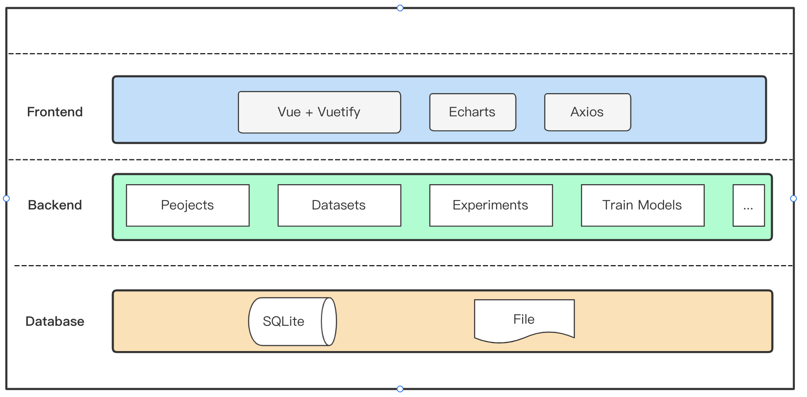

# AI Web

> This is a simple web application, it includes three main features,
> - projects management
> - datasets management (data upload)
> - experiments management (fit model)

## How To Run

### Run By Docker Compose

```shell
# unzip the source code
> unzip ai-web.zip
> cd ai-web
> docker-compose up
```

#### Visit Web Portal

> http://127.0.0.1:8080/
 


### Run By Command

> Just read the **READEME.md** file of two child models to run the frontend and backend separately.

## Framework Info

### Base Structure



### Database Design


